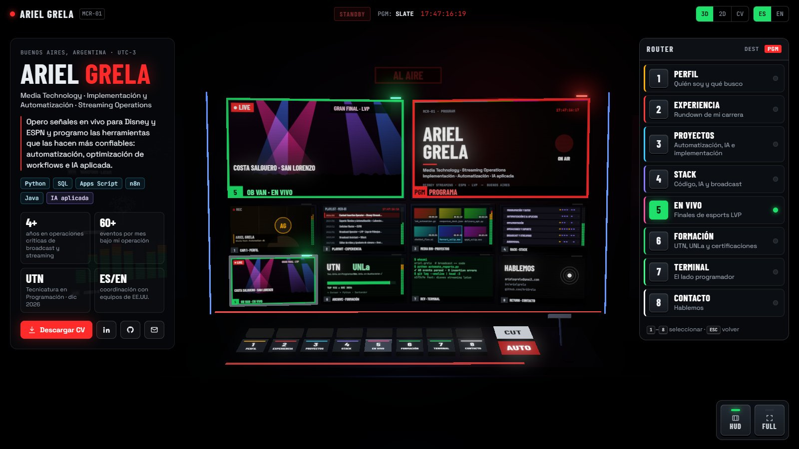

# MCR-01 · Ariel Grela

**En vivo:** https://arielgrela.vercel.app · [versión en inglés](https://arielgrela.vercel.app/?lang=en) · [CV simple](https://arielgrela.vercel.app/#cv)



Portfolio / CV interactivo con forma de **master control room**: una pared de monitores en 3D, un switcher con teclas físicas y una terminal. Cada monitor es una sección del CV; tocarlo (o apretar `1`–`8`) lo pasa a PVW, hace el AUTO con la T-bar y lo saca al aire.

- **3D** (desktop): React Three Fiber + postprocessing. Se carga aparte (lazy), así que la vista 2D y el CV no pagan el peso de three.js.
- **2D** (celulares, equipos sin WebGL o a elección): multiviewer en CSS.
- **CV** (`/#cv`): versión simple, imprimible, para recruiters y ATS.
- Bilingüe ES/EN (`?lang=en` para compartir directo en inglés). Deep links: `/#experience`, `/#live`, `/#terminal`…

## Editar el contenido

Todo el contenido vive en **`src/data/cv.json`** (bilingüe). La web y los PDFs salen de ahí.

Después de editarlo, regenerá los PDFs descargables (usan Arial de Windows; no incluyen teléfono a propósito):

```bash
python scripts/build_cv_pdf.py
```

La imagen para compartir en redes (`public/og.png`) se regenera con:

```bash
python scripts/build_og_image.py
```

## Desarrollo

```bash
npm install
npm run dev
npm run build
```

Flags de depuración: `?noboot` (salta el arranque), `?forceboot` (lo fuerza aunque el sistema pida menos animación), `?nofx` (sin bloom), `?shot` (conserva el frame para capturas automáticas).

## Estructura

```
src/
  data/cv.json        contenido (ES/EN)
  sections.ts         las 8 fuentes del switcher
  store.ts            estado: PVW / PGM / panel / idioma / vista
  scene/              control room 3D (monitores, switcher, cámara, pantallas pintadas en canvas)
  ui/                 HUD, panel de programa, terminal, vista 2D y CV simple
scripts/              generadores de PDF y og.png
```

## Deploy

Vercel detecta Vite solo:

```bash
npx vercel deploy --prod
```
